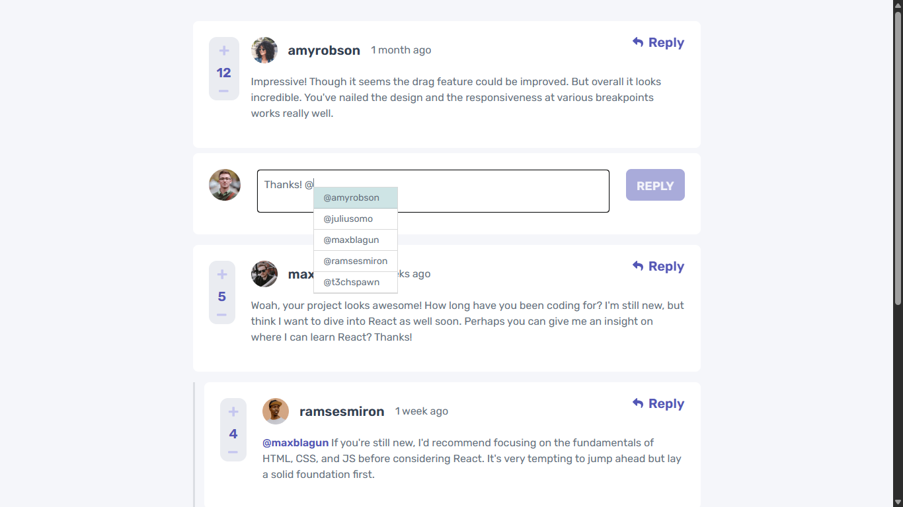

# Interactive Comments Section

## About

This is a functional CRUD app that lets you Create, Read, Update and Delete comments. I added a mentions feature that lets you tag other users to your comment. I also added a cool page transition animation. Please enjoy.

## Technologies used

React Tailwind, GSAP

### Screenshot

### Links

- Live Site URL: [https://feng-comments.netlify.app](https://feng-comments.netlify.app)

### Built with
 
- Vite
- Mobile-first workflow
